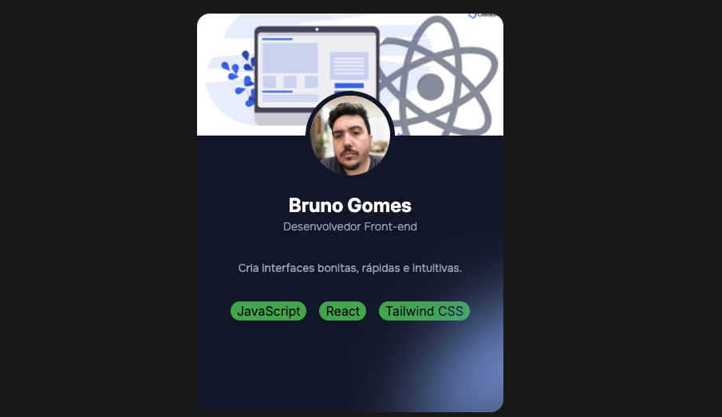

# 💼 Desafio 01 da mentoria do Zero ao Dev Junior

Este projeto é um **card de apresentação pessoal** desenvolvido com **React**, **TypeScript** e **Vite**. Ele exibe uma foto, nome e uma breve descrição, sendo ideal para portfólios, sites pessoais ou apresentações online.

## 🚀 Tecnologias Utilizadas

- [React](https://reactjs.org/)
- [TypeScript](https://www.typescriptlang.org/)
- [Vite](https://vitejs.dev/)
- [Tailwind CSS](https://tailwindcss.com) (ou a biblioteca de estilos que você preferir)


## 📸 Demonstração



## 🔧 Como Executar o Projeto

1. **Clone o repositório:**

   ```bash
   git clone https://github.com/bgoomes/desafio01.git
   ```

2. **Navegue até o diretório do projeto:**

   ```bash
   cd desafio01
   ```

3. **Instale as dependências:**

   ```bash
   npm install
   ```

4. **Inicie o servidor de desenvolvimento:**

   ```bash
   npm run dev
   ```

5. **Acesse o projeto no navegador:**

   Abra [http://localhost:5173](http://localhost:5173) para visualizar o card.

## 🎯 Funcionalidades

- Exibição de foto de perfil.
- Apresentação do nome.
- Breve descrição pessoal

## 📌 Melhorias Futuras

- Adicionar links para redes sociais.
- Implementar animações nos elementos do card.
- Criar uma versão interativa com mais informações ao clicar.

## 📝 Licença

Este projeto está licenciado sob a [MIT License](LICENSE).
